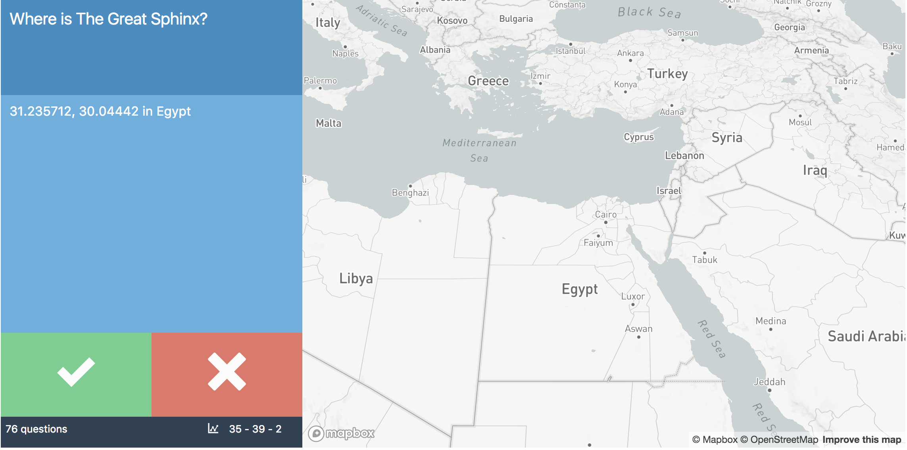

# Overview

Web app for learning famous places and their lat/long coordinates

# Usage

Provide an array of locations, and a web app serves the question, checks answer, and uses Google Earth to fly to that location.

# Thank You

Carl Sednaoui's [ouicards](https://github.com/carlsednaoui/ouicards)
